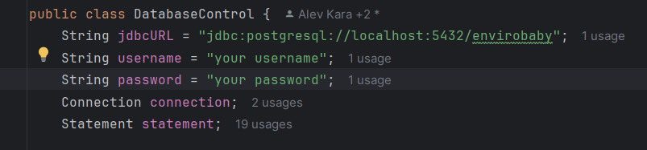

# Group 6 - System development


## Purpose and benefits

Envirobaby is a desktop application, designed to provide nurseries with reliable real-time monitoring about key environmental factors. 
The system continuously tracks temperature, humidity and noise levels to ensure optimal conditions for babies and young children, keeping them healthy and comfortable.
It also provides caregivers with real-time alerts when any of the environmental parameters breach their predefined thresholds, and allows customisation in order to make the system suitable for specific childcare needs.

By automating the monitoring process, Envirobaby offers nurseries improved resource management. 
Caregivers can now spend less time manually checking and monitoring room conditions, and focus more on direct childcare. 
Furthermore, this also improves children’s safety and comfort by reducing the risk of human error. The system is designed to be scalable for up to 4 nursery rooms, making it suitable for larger-scale nurseries as well.
***

## System Architecture

This is our system architecture, displaying the architect for the software and the hardware: 


Click [here](https://drive.google.com/file/d/1lQnLxKE-23G7OKVCaXYln47tVGS6P1wJ/view?usp=sharing) to see even higher quality picture of the software architecture.

***
## Get Started
The instructions will help you set up and run Envirobaby.

### Hardware Requirements:
- [Wio Terminal](https://www.seeedstudio.com/Wio-Terminal-p-4509.html)
- [Wio Accessories](https://www.seeedstudio.com/Wio-Terminal-Chassis-Battery-650mAh-p-4756.html) (Optional)
- Sensors [click here for list of sensors](https://git.chalmers.se/courses/dit113/2024/group-6/EnviroBaby/-/wikis/System-Sensors)
- Wires

### Software Requirements:
- Arduino IDE
- Arduino Libraries 
  - DHT sensor library
  - Seed Arduino rpcWiFi
  - PubSubClient
- Git
- Preferable IDE (Intellij, VScode, etc..)
- JDK Version 20 and above
- Maven
- PostgreSQL
***
## Installation
### Setting up Arduino IDE:

First, [download](https://www.arduino.cc/en/software) and install the Arduino IDE software according to your computer operating system, detailed installation steps can be found [here](https://wiki.seeedstudio.com/Wio-Terminal-Getting-Started/).
Now, it's time to install the dependent libraries for Arduino, navigate to ‘_library manager_’
**(_Sketch > Include Library > Manage Libraries_)**; a window should pop up from the left.
Search the library (walk through the '_Software Requirement_' section to know the required libraries) names and click install, make sure to download the latest version.

### Git Clone:

The code to run EnviroBaby can be found in the EnviroBaby repository, the codes can be retrieved via git. Here is a step-by-step process:
- Open git in your command line.
- Navigate to your GitLab accessed folder **(_cd path/path/_)**.
- Write ‘_**git clone git@git.chalmers.se:courses/dit113/2024/group-6/EnviroBaby.git**_’ in the command line.
- You have successfully cloned the repository. HERE WE GO!

### Connecting The Sensors:

Assuming you have the two sensors and you don't have the Wio Accessories (The battery),
let's follow the step to establish a pin connection between the sensors and Wio terminal:

- First let's go through the [Get started with Wio Terminal](https://wiki.seeedstudio.com/Wio-Terminal-Getting-Started/).
- Now we have enough knowledge about the pin connections.
- Below we can see the defined pin in Arduino code specifically in the wio_pin.h tab.


- Loudness sensor should be connected to pin A0, and Temp&Hum sensor should be connected to A4 pin.
Now, let’s connect the sensor to Wio according to the pin declaration.
- As we know ([Get started with Wio Terminal](https://wiki.seeedstudio.com/Wio-Terminal-Getting-Started/)) PIN A0 is located on the right port of Wio Terminal, lets connect the Loudness sensor to it (snippet below for better understanding).


- Let’s connect our second sensor Temp&Humi Sensor to PIN A4, assuming we don’t have the Wio Accessories (Battery) we have to connect the PINs manually, kindly refer to Pinout Diagram in [Get started with Wio Terminal](https://wiki.seeedstudio.com/Wio-Terminal-Getting-Started/).
- Steps to connect the Temp&Humi sensor;  <br> let’s have the format in this way (_Wire Color, Pinout Number_),
  <br>- (Red, 1);
  <br>- (Black, 9);
  <br>- (White, 18);
  <br>- (Yellow, 22);


- Assuming we have the Wio Accessories (Battery), we connect the sensor to the right side in the first port (PIN A4).


- We are ready for the next step!

### Wio Terminal:
As EnviroBaby has four rooms you will need four Wio Terminals to benefit from the whole system.
As far now we assume you have properly followed the previous steps described and installed Arduino and cloned the repository.
Here is a step by step guide: <br>
- Start Arduino IDE, and navigate to **(_File > Open > ‘path where Envirobaby is cloned’_)**.
- Once inside the EnviroBaby directory you will see a file called ‘wioTerminal’, then navigate to **(_wioTerminal > envirobaby > envirobaby_)** and click open.
- Now Arduino will open the file containing code for wio terminal.
- Navigate to the tab named ‘_mqtt_wifi.cpp_’.
- Lets notice the ‘_variable declarations_’ part:


- The above snippet part is declared for one singular Wio terminal, specifically room 1. 
We can notice it by looking through the variable declarations:
 ```
const char* mqttMainTopic = "/envirobaby/room1/";
const char* mqttClientId = "EnviroBabyWIoRoom1";
const char* mqttRoomBuzzer = "/envirobaby/room1/buzzer";
```

Additionally SSID and PASSWORD should be declared, protected wifi networks won't work.
- Next step involves connecting the Wio Terminal to your computer, make sure to have your Wio Terminal turned on.
- Once connected to the computer, Arduino IDE should show the specific port the Wio Terminal is connected to, simply select that port by clicking on the option.


- It's time to compile, once the WiFi variables are declared and topics are updated according to rooms (topic change step below) click the arrow button (red box) on top left corner of Arduino IDE.
- Once compiled the output terminal should print a message saying ‘_Verify successful_’.
- Next part is opening the ‘_Serial Monitor_’ window in order to start the setup, the button to start the serial monitor (marked in red below) is on the top right corner of Arduino IDE.


- **CONGRATULATION!** The Wio Terminal should start once connected to the WiFi.

### Setting Up Wio Terminal for Different Rooms:
Envirobaby’s current version has 4 rooms but we can extend it to more rooms according to our need, current demonstration will show to set it up for 4 Rooms.
- From the section **Wio Terminal** we get to know about the ‘_variable declarations_’.
<br>Specifically this part:
```
const char* mqttMainTopic = "/envirobaby/room1/";
const char* mqttClientId = "EnviroBabyWIoRoom1";
const char* mqttRoomBuzzer = "/envirobaby/room1/buzzer";
```

- Let's install it for room 2, we follow the same steps as **Wio Terminal** but we make few changes in these ‘_variable declarations_’ in ‘_mqtt_wifi.cpp_’.
<br >Here is a solved version of the code snippet that needs to be replaced for room 2;
```
const char* mqttMainTopic = "/envirobaby/room2/";
const char* mqttClientId = "EnviroBabyWIoRoom2";
const char* mqttRoomBuzzer = "/envirobaby/room2/buzzer";
```

- For Room 3:
```
const char* mqttMainTopic = "/envirobaby/room3/";
const char* mqttClientId = "EnviroBabyWIoRoom3";
const char* mqttRoomBuzzer = "/envirobaby/room3/buzzer";
```
If we notice carefully we can see that every time we try to install a new Wio Terminal we change the room number according to the room in the real world.

**N.B.:** Let’s start with an example; we have three rooms 1, 2 and 3.
If we remove room 2 and want to reconfigure room 2, as users we must be careful to initialize ‘_variable declarations_’ for specifically room 2.

### Starting the App:

### Installing the Database

- Follow this [video](https://www.youtube.com/watch?v=0n41UTkOBb0&ab_channel=GeekyScript) to download the database and stop right after cancelling the installation of 'StackBuilder'
- On your task bar search, type 'pgAdmin 4'
- After entering, on the top left, press 'Server'
- Enter the password you set during installation
- Expand 'Database'
- Right click on 'Database' and press 'Create' and then 'Database...'
- Enter the name of the database as 'envirobaby'
- Then from the task bard, search 'psql'
- Upon entering the shell, enter your user name and password.
- After that enter '\c envirobaby' and press enter
- After that, paste in the following schema -

```
CREATE TABLE USERS (
id VARCHAR(15) PRIMARY KEY,
password VARCHAR(20),
noise_alert_setting BOOLEAN DEFAULT TRUE,
temp_alert_setting BOOLEAN DEFAULT TRUE,
hum_alert_setting BOOLEAN DEFAULT TRUE
);

CREATE TABLE ROOM(
room_name VARCHAR(8),
userid VARCHAR(15),
capacity INTEGER,
age_group boolean,
maxnoise INTEGER,
maxtemp NUMERIC(5,2),
mintemp NUMERIC(5,2),
maxhum NUMERIC(5,2),
minhum NUMERIC(5,2),
noise_alerts BOOLEAN,
temp_alerts BOOLEAN,
hum_alerts BOOLEAN,

    PRIMARY KEY(userid, room_name),
    FOREIGN KEY (userid)
        REFERENCES USERS(id)
        ON UPDATE CASCADE
        ON DELETE CASCADE
);

CREATE TABLE RECORD(
userid VARCHAR(15),
room_name VARCHAR(8),
record_date DATE,
record_time TIME WITHOUT TIME ZONE,
loud_data INTEGER,
temp_data NUMERIC(5,2),
hum_data NUMERIC(5,2),

    PRIMARY KEY(userid, room_name, record_date, record_time),
    FOREIGN KEY(userid, room_name)
        REFERENCES ROOM(userid, room_name)
        ON UPDATE CASCADE
        ON DELETE CASCADE
);
```
- Go to intellij, and go to DatabaseControl in 'Database' package and enter the following -



Considering we have Intellij IDEA, let's start with running the App through GUI.
Open the EnviroBaby in Intellij **(_File > Open > Path To EnviroBaby_)**.
Envirobaby is now open in Intellij, let's follow the step below:
- Now, let's open the class called ‘_EnviroBabyApp.java_’ **(_src/main/java/org/example/envirobaby/Interface/EnviroBabyApp.java_)**.
- On the next step we run the file, and wait for the build to compile.
- CONGRATULATION! The GUI popped up, you are in the App.

## Team Contribution

- Feride Hansson: Made significant contributions to developing the GUI with JavaFX and programming in Arduino, and played a key role in drafting requirements and user stories.
- Nadman Abdullah Bin Faisal: Made significant contribution in GUI development using JavaFX and programming WIO terminal with Arduino. Also contributed to creating requirements and user stories.
- Alev Kara: Contributed largely on database creation, data visualization, and improving the UI, in addition to creating requirements and user stories.
- Mesimaaria Alastalo: Played crucial role in developing the GUI with JavaFX and helped create requirements and user stories.
- Hasan Zahid: Specialized in programming the WIO terminal with Arduino and refactoring Arduino files, alongside contributing to requirements and user stories.

## Demo Video

To watch our demo video, click [here](https://youtu.be/ME3XJxVz600).